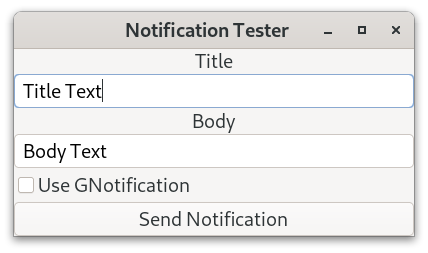
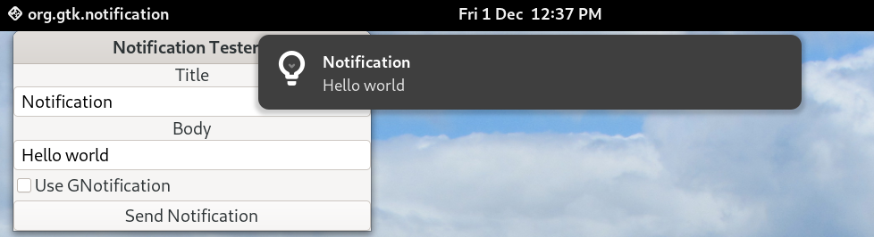
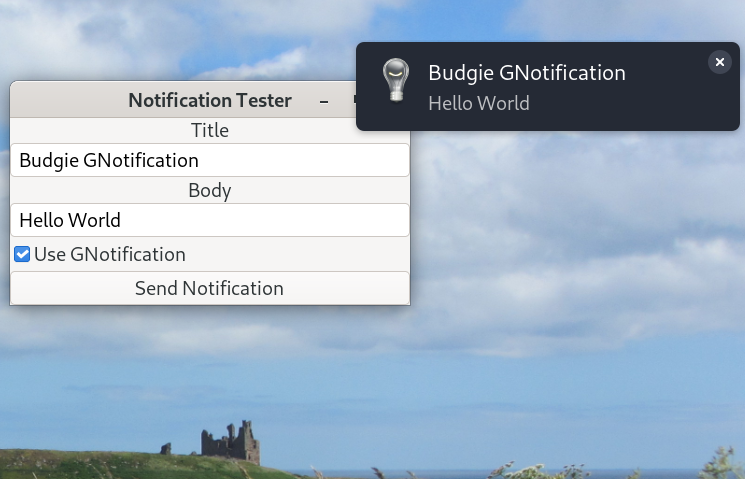

# Notification Tester

Notification Tester is a small Linux GTK4 application for sending notications using either libnotify and GNotification.



## Prebuilt Binary

A 64 bit prebuilt binary is available and can be downloaded from the binary directory and can be used with Linux distributions that have GTK4 4.8 (or below) in their repositories such as  Debian 12 Bookworm, Ubuntu 22.04, Fedora 35 onwards etc.

Extract the downloaded file which contains the Notification Tester executable.

Assuming that the GTK4 base libraries are installed the Notification Tester binary can be run from the terminal using:

```
./notifytest
```

or double click on the "notifytest" file. Make sure it has executable permissions. Right click on it, then select permissions and ensure "Allow executing file as program" is selected.

## Build From Source

The C source code for the Notification Tester application is provided in the src directory.

[Geany](https://www.geany.org/) can be used as a source code editor for opening, viewing and then compiling the C code. Geany is lightweight and has an integrated terminal for building the application.

You need the GTK4 development libraries and the gcc compiler. The code has been compiled using GTK 4.8.3 amd64 (Debian 12). To determine which version of GTK4 is running on a Linux system use the following terminal command.

```
dpkg -l | grep libgtk*
```
With both  Debian Bookworm and Ubuntu and you need to install the following packages to compile the Notification Tester.

```
sudo apt install build-essential
sudo apt install libgtk-4-dev
sudo apt install libnotify-dev
```
Glib should be installed. If not use the command below.

```
sudo apt-get install libglib2.0-dev
```

### Testing

Sending notification using libnotify works on both Debian GNOME (Wayland) and Debian Budgie(X11). The library libnotify is an implementation of the [Desktop Notifications Specification](https://specifications.freedesktop.org/notification-spec/notification-spec-latest.html) which provides support for GTK and Qt applications and is ***desktop independent***. The library libnotify sends desktop notifications to a notification daemon (server). To use it you need to install the development files for the library i.e. the libnotify-dev package. 

```
sudo apt install libnotify-dev
```

A notification test using libnotify on Debian GNOME is shown in the screenshot below.



The GNotification test code works with Debian Budgie(X11) but not on Debian GNOME (Wayland). A notification test using GNotification on Debian Budgie 10.7 is shown in the screenshot below.



I need to do more research on why the GNotification code does not work on Debian GNOME. With GLib based applications the GNotification API is recommneded. At first I thought it was because a notification deamon may need to be installed. I search for notification deamons as shown below.

```
apt-cache search notification | grep daemon | grep notification
```
which resulted in the following

```
corosync-notifyd - cluster engine notification daemon
dunst - dmenu-ish notification-daemon
gir1.2-notify-0.7 - sends desktop notifications to a notification daemon (Introspection files)
libnotify-bin - sends desktop notifications to a notification daemon (Utilities)
libnotify-dev - sends desktop notifications to a notification daemon (Development files)
libnotify-doc - sends desktop notifications to a notification daemon (Documentation)
libnotify4 - sends desktop notifications to a notification daemon
lxqt-notificationd - LXQt notification daemon
mailnag - extensible mail notification daemon
mako-notifier - lightweight notification daemon for Wayland compositors
mate-notification-daemon - daemon to display passive popup notifications
mate-notification-daemon-common - daemon to display passive popup notifications (common files)
notification-daemon - daemon for displaying passive pop-up notifications
notify-osd - daemon that displays passive pop-up notifications
sway-notification-center - simple notification daemon for sway
ukui-notification-daemon - daemon to display passive popup notifications
xfce4-notifyd - simple, visually-appealing notification daemon for Xfce
```

Nothing obvious seemed to be needed for GNotification.

To add an application to the GNOME notification list in the desktop settings you add the following to the desktop file.
```
X-GNOME-UsesNotifications=true
```

You can also install

```
sudo apt install notify-send
```
to send notifications from the terminal.


My tests show that sending notications using different desktops can be done using libnotify.


## Author

* **Alan Crispin** [Github](https://github.com/crispinprojects)

## License

Notification Tester is licensed under LGPL v2.1. GTK is released under the terms of the LGPL v2.1 license.

## Project Status

Active.

## Acknowledgements

* [GTK](https://www.gtk.org/)

* [libnotify](https://gitlab.gnome.org/GNOME/libnotify)

* [GNotification](https://docs.gtk.org/gio/class.Notification.html)

* The [org.freedesktop.Notifications](https://specifications.freedesktop.org/notification-spec/notification-spec-latest.html) Desktop Specification.


